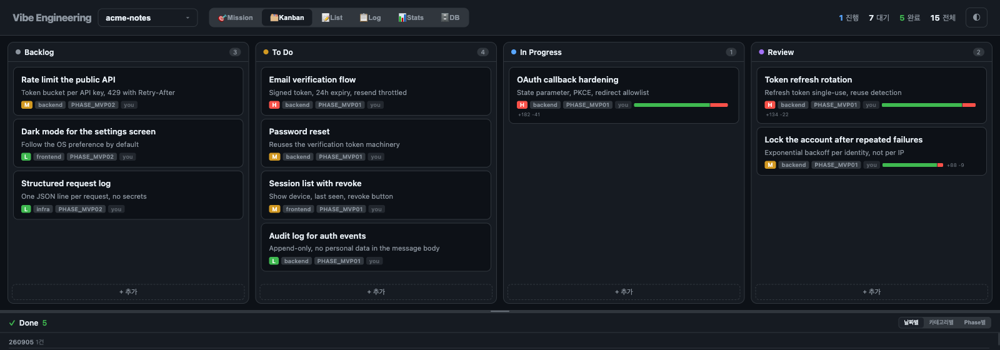
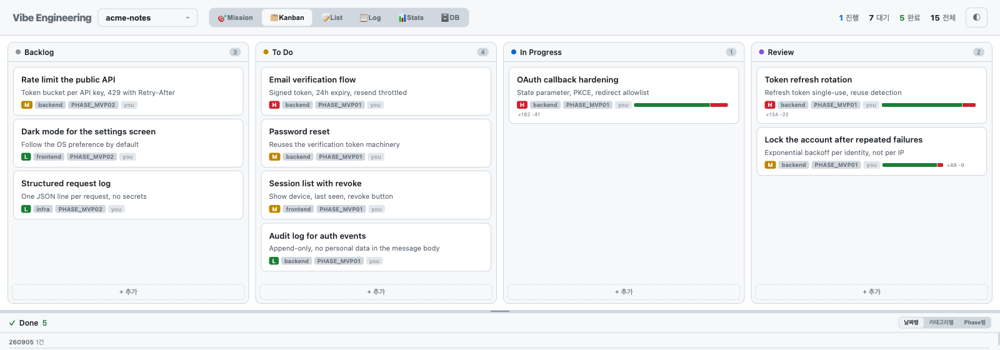
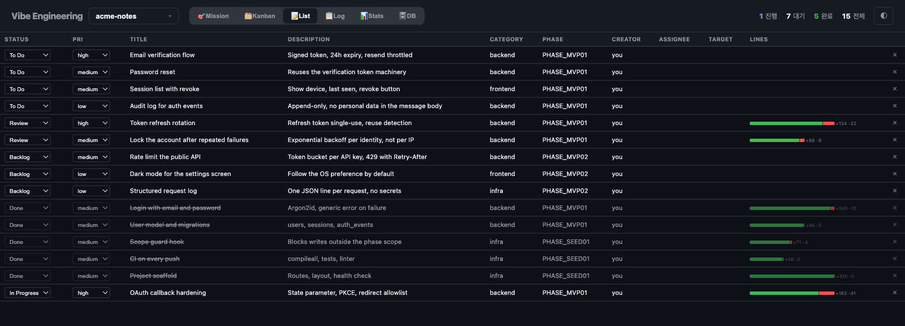
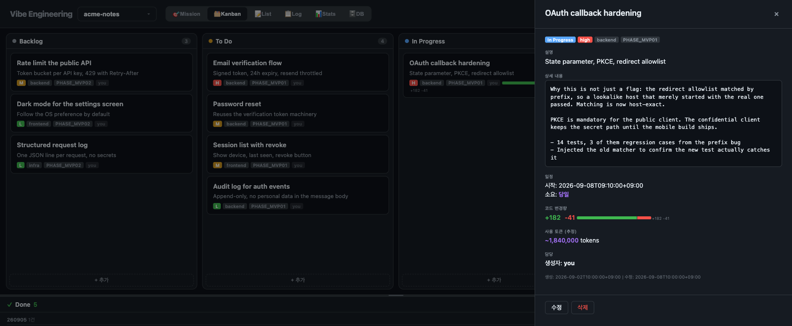

# VibeKanban

Dev progress kanban board for [Claude Code](https://claude.ai/claude-code).
Track tasks, code changes, and work reports — all from your terminal.
**Multi-user ready**: share your kanban via git, just like code.

### Kanban View (Dark)


### Kanban View (Light)


### List View


### Detail Panel


## Features

- **Multi-user** — JSON storage means `git pull/push` just works. Multiple developers share one kanban via git — no binary conflicts, no export/import ceremony.
- **Multi-project** — One server, multiple projects via tabs
- **Git-friendly** — Text-based JSON files. Diffs, merges, code review all work naturally.
- **Auto-tracking** — `started_at` / `completed_at` set automatically on status change
- **Code change stats** — `lines_added`, `lines_removed` from `git diff`
- **Work reports** — Per-task details (changed files, decisions, follow-ups)
- **Archive** — Done tasks archived to monthly files, always visible in dashboard
- **Code review** — Auto-triggered on `git push` / `gh pr create` via Claude Code hook
- **Kanban + List views** — Drag & drop kanban or spreadsheet-style inline editing
- **Done grouping** — By date, category, or phase
- **Dark / Light mode** — Toggle with localStorage persistence
- **Auto-start** — macOS LaunchAgent keeps the server running across reboots
- **Progress sync** — Import from existing PROGRESS.md / devlog files
- **Zero dependencies** — Pure Python + vanilla JS. No npm, no build step.

## Install

### Step 1. Clone the repo (anywhere you like)

```bash
cd ~/dev        # or wherever you keep repos
git clone https://github.com/hoarchi/vibekanban.git
```

### Step 2. Run setup

```bash
cd vibekanban
python3 scripts/setup.py
```

This does 4 things:
1. Copies `SKILL.md`, `server.py`, `kanban.html` to `~/.claude/skills/vibekanban/`
2. Migrates old project registry (SQLite paths → JSON paths) if needed
3. Installs a macOS LaunchAgent — server auto-starts on login (port 4242)
4. Registers a code review hook in `~/.claude/settings.json`

After setup, the cloned repo is no longer needed for daily use. You can keep it for updates.

### Verify

```bash
curl http://localhost:4242/api/projects
# Should return [] (empty project list)
```

### Uninstall

```bash
cd ~/dev/vibekanban    # or wherever you cloned it
python3 scripts/setup.py uninstall
```

## Quick Start

### 1. Start the server

If you ran `setup.py`, the server is already running via launchd. Otherwise:

```bash
python3 ~/.claude/skills/vibekanban/server.py serve 4242 &
```

### 2. Register your project

```bash
python3 ~/.claude/skills/vibekanban/server.py register my_project "My Project" "$(pwd)/vibekanban"
```

### 3. Open the board

Visit [http://localhost:4242/kanban](http://localhost:4242/kanban)

### 4. Use with Claude Code

Just tell Claude what to do. The skill automatically:
- Creates tasks when you request work
- Moves tasks to `in_progress` when starting
- Records code changes and work reports on completion
- Tracks everything in the kanban board

Or use explicit commands:

```
/vibekanban serve      → Start server + register project
/vibekanban add title  → Add a task
/vibekanban done 3     → Mark task #3 as done
/vibekanban archive    → Archive done tasks to monthly files
/vibekanban report     → Today's summary
```

## How It Works

```
Claude Code ──(curl)──→ localhost:4242 ──(JSON)──→ vibekanban/kanban.json
                              │
                         kanban.html
                              │
                        Your Browser
```

All server files live in one directory:

```
~/.claude/skills/vibekanban/
  SKILL.md           ← Skill definition (Claude reads this)
  server.py          ← Python HTTP server (API + static)
  kanban.html        ← Single-file vanilla JS frontend
  projects.json      ← Project registry (auto-generated)
  server.log         ← Server output log
```

Per-project data (git-tracked):

```
{project}/vibekanban/
  kanban.json              ← Active tasks (todo, in_progress, review, recent done)
  archive/
    2026-03.json           ← Monthly archive of completed tasks
    2026-04.json
```

Other:

- **LaunchAgent**: `~/Library/LaunchAgents/com.vibekanban.server.plist` — Auto-start on login
- **Hook**: `~/.claude/hooks/vibekanban-review.sh` — Code review trigger on push/PR

## Web UI

### Kanban View
4 active columns (Backlog, To Do, In Progress, Review) with drag & drop.
Cards show title, description, priority, category, D-day countdown, and code change bars.
Edit/delete buttons on hover (active cards only — Done cards open detail panel).

### List View
Spreadsheet-style table with ALL tasks including Done.
Inline editing — click any cell to edit, changes save automatically.

### Done Zone
Completed tasks grouped by:
- **Date** — Completion date (YYMMDD format)
- **Category** — backend, frontend, infra, etc.
- **Phase** — Phase 1, Phase 2, etc.

Archived tasks are loaded and displayed alongside active done tasks — all visible in one view.

### Detail Panel
Click any card to open the right slide-in panel with:
- Full description and work report
- Code review items with interactive resolved/unresolved toggles
- Schedule (target, started, completed, elapsed time)
- Code change stats (+/- bar graph)

### Code Review
Tasks can have code review items stored as structured data:
- Review findings are shown in the detail panel with **resolved/unresolved** radio buttons
- Cards display a review badge: green `Review ✓` when all resolved, orange `N unresolved` otherwise
- Auto-triggered via Claude Code hook on `git push` or `gh pr create`
- Also runs during `qq` (daily wrap-up) for uncommitted/unpushed changes
- Review covers security (OWASP), code quality, and architecture concerns

## API Reference

| Method | Endpoint | Description |
|--------|----------|-------------|
| GET | `/api/projects` | List all projects |
| POST | `/api/projects` | Register a project |
| GET | `/api/{key}/tasks` | List tasks (active + archived) |
| POST | `/api/{key}/tasks` | Create task |
| PUT | `/api/{key}/tasks/{id}` | Update task |
| DELETE | `/api/{key}/tasks/{id}` | Delete task |
| POST | `/api/{key}/tasks/bulk` | Bulk create tasks |
| GET | `/api/{key}/export` | Export all tasks to JSON |
| POST | `/api/{key}/import` | Import tasks from JSON |
| POST | `/api/{key}/archive` | Archive done tasks to monthly files |
| GET | `/api/{key}/stats` | Task count by status |

### Task Fields

| Field | Type | Description |
|-------|------|-------------|
| title | string | Task title (required) |
| description | string | Brief description |
| details | string | Work report (files changed, decisions, notes) |
| status | string | `backlog` / `todo` / `in_progress` / `review` / `done` |
| priority | string | `low` / `medium` / `high` |
| category | string | `backend` / `frontend` / `infra` / `data` / `docs` / `qa` |
| phase | string | Phase grouping (e.g., "Phase 1") |
| target_date | string | Target date (YYYY-MM-DD) |
| started_at | string | Auto-set when → in_progress |
| completed_at | string | Auto-set when → done |
| lines_added | int | Lines of code added |
| lines_removed | int | Lines of code removed |
| position | int | Sort order within column |
| review | string | JSON array of review items: `[{"text":"...","resolved":false}]` |
| created_by | string | Creator (auto-set from `git config user.name`) |
| assigned_to | string | Assignee (set on `/vibekanban start`) |

## Requirements

- Python 3.6+
- Claude Code CLI
- macOS (for LaunchAgent auto-start; server works on any OS)

No npm. No pip install. No build step. Just Python and a browser.

## License

MIT — [Hogun Jung](https://github.com/hoarchi) / [Zest Inc.](https://zest.im)
